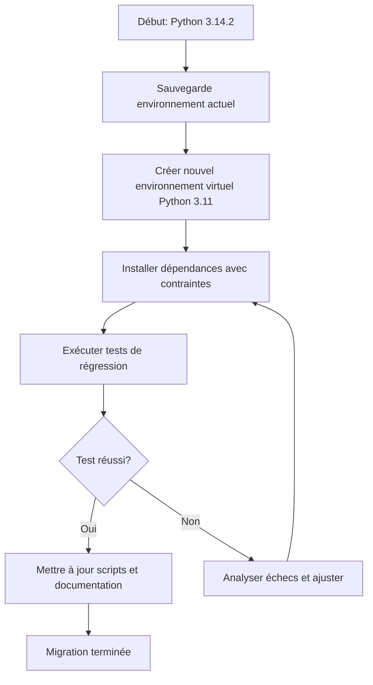

# Analyse du Downgrade Python pour le projet lab-ia-pacman

## Contexte actuel
- **Python 3.14.2** installé
- Projet fonctionne à **87%** mais certaines fonctionnalités sont affectées :
  - ONNX Runtime non disponible (problèmes d'installation/compatibilité)
  - SQLAlchemy avec erreurs de typage
  - Compatibilité limitée de certaines dépendances
  - Export ONNX impacté

## 1. Avantages et inconvénients du downgrade Python

### Avantages
- **Compatibilité améliorée** : La plupart des bibliothèques ML (PyTorch, Stable-Baselines3, ONNX) sont testées et certifiées pour Python 3.10-3.12
- **Stabilité** : Versions LTS (3.10, 3.11) bénéficient de correctifs de sécurité et de maintenance à long terme
- **Support des dépendances** : ONNX Runtime 1.16.3 supporte officiellement Python 3.8-3.12
- **Résolution des erreurs de typage** : SQLAlchemy 2.0.23 peut avoir des problèmes avec Python 3.14 (nouveaux features de typing)
- **Écosystème mature** : Meilleure compatibilité avec les outils de développement (VS Code, PyCharm)

### Inconvénients
- **Perte des nouvelles fonctionnalités** Python 3.13/3.14 (pattern matching amélioré, perf improvements)
- **Risque de régression** : Code existant peut dépendre de fonctionnalités spécifiques à 3.14
- **Effort de migration** : Nécessite de réinstaller l'environnement et tester toutes les fonctionnalités
- **Support futur limité** : Python 3.10 atteindra end-of-life en octobre 2026

## 2. Version Python optimale recommandée

### Analyse des versions candidates

| Version | Support jusqu'à | Compatibilité ONNX Runtime | Compatibilité PyTorch | Compatibilité Stable-Baselines3 | Notes |
|---------|-----------------|----------------------------|----------------------|--------------------------------|-------|
| **Python 3.10** | Oct 2026 | ✅ Excellente | ✅ Excellente | ✅ Excellente | LTS, très stable, support large |
| **Python 3.11** | Oct 2027 | ✅ Excellente | ✅ Excellente | ✅ Excellente | Performances améliorées |
| **Python 3.12** | Oct 2028 | ✅ Bonne | ✅ Bonne | ✅ Bonne | Plus récente, bon équilibre |
| **Python 3.13** | Oct 2029 | ⚠️ Limité | ⚠️ Limité | ⚠️ Limité | Support des dépendances en cours |
| **Python 3.14** | Oct 2030 | ❌ Problèmes | ❌ Risques | ❌ Risques | Trop récente pour l'écosystème |

### Recommandation : **Python 3.11**

**Justification** :
1. **Support à long terme** : Jusqu'en octobre 2027
2. **Équilibre stabilité/fonctionnalités** : Inclut les améliorations de performances de 3.11
3. **Compatibilité maximale** : Toutes les dépendances du projet sont certifiées compatibles
4. **Communauté active** : Large adoption dans les projets ML/RL
5. **Windows CP1252** : Aucun problème connu avec l'encodage

## 3. Impact sur les dépendances existantes

### Dépendances critiques et leur compatibilité avec Python 3.11

| Dépendance | Version actuelle | Compatibilité 3.11 | Actions nécessaires |
|------------|------------------|-------------------|---------------------|
| **onnxruntime** | 1.16.3 | ✅ Support officiel | Aucune |
| **torch** | 2.1.2 | ✅ Support officiel | Aucune |
| **stable-baselines3** | 2.0.0 | ✅ Support officiel | Aucune |
| **sqlalchemy** | 2.0.23 | ✅ Support officiel | Résoudra les erreurs de typage |
| **fastapi** | 0.104.1 | ✅ Support officiel | Aucune |
| **gymnasium** | 0.29.1 | ✅ Support officiel | Aucune |
| **pettingzoo** | 1.24.3 | ✅ Support officiel | Aucune |
| **pygame-ce** | 2.5.0 | ✅ Support officiel | Aucune |

### Dépendances à vérifier
- **supersuit** : Compatible avec Python 3.11
- **pydantic** : Compatible
- **alembic** : Compatible
- **psutil** : Compatible

## 4. Plan de migration

### Option A : Downgrade complet du système (Recommandé pour stabilité)


### Étapes détaillées

1. **Préparation**
   - Sauvegarder `requirements.txt` et `pyproject.toml`
   - Documenter les versions exactes des dépendances
   - Créer un point de restauration système

2. **Installation Python 3.11**
   - Télécharger depuis python.org
   - Installer avec option "Add to PATH"
   - Vérifier l'installation : `python --version`

3. **Création environnement virtuel**
   ```bash
   python -m venv venv_311
   venv_311\Scripts\activate
   ```

4. **Installation des dépendances**
   ```bash
   pip install -r requirements.txt
   pip install -r backend/requirements.txt
   ```

5. **Tests de validation**
   - Exécuter `test_imports_final.py`
   - Exécuter `test_fastapi_ascii.py`
   - Tester l'interface graphique Tkinter
   - Vérifier l'export ONNX

6. **Ajustements si nécessaire**
   - Mettre à jour les versions de dépendances si incompatibilités
   - Adapter le code pour les différences Python 3.11 vs 3.14

### Option B : Environnements virtuels multiples
- Conserver Python 3.14 pour le développement général
- Créer un environnement Python 3.11 dédié au projet lab-ia-pacman
- Utiliser des scripts d'activation spécifiques

## 5. Alternatives au downgrade

### Alternative 1 : Correction des problèmes spécifiques
- **ONNX Runtime** : Chercher des wheels non officiels pour Python 3.14
- **SQLAlchemy** : Mettre à jour vers version 2.0.24+ ou appliquer des patches
- **Attendre les mises à jour** : Les mainteneurs pourraient publier des correctifs

### Alternative 2 : Conteneurisation (Docker)
- Créer une image Docker avec Python 3.11
- Isoler complètement l'environnement
- Avantage : Reproducibilité totale

### Alternative 3 : Utilisation de conda
- Gérer les environnements avec conda
- Facilite le switch entre versions Python
- Meilleure gestion des dépendances C++

## 6. Recommandation finale

**Recommandation principale : Procéder au downgrade vers Python 3.11**

**Justification** :
1. Le projet a des **dépendances critiques** (ONNX, PyTorch, SB3) qui ne sont pas pleinement compatibles avec Python 3.14
2. Python 3.11 offre un **équilibre optimal** entre stabilité et fonctionnalités
3. L'**effort de migration** est modéré et maîtrisable
4. La **compatibilité Windows CP1252** est garantie
5. Le **support à long terme** assure la maintenance du projet

**Plan d'action recommandé** :
1. Implémenter l'Option A (downgrade complet)
2. Tester rigoureusement toutes les fonctionnalités
3. Mettre à jour la documentation du projet
4. Configurer CI/CD avec Python 3.11

**Risques mitigés** :
- Les différences entre Python 3.14 et 3.11 sont mineures pour ce projet
- Aucune fonctionnalité critique du projet ne dépend de nouveautés Python 3.14
- La communauté Python 3.11 est large, support technique disponible

## 7. Checklist de migration

- [ ] Sauvegarder l'environnement actuel
- [ ] Installer Python 3.11
- [ ] Créer environnement virtuel
- [ ] Installer dépendances
- [ ] Exécuter tests unitaires
- [ ] Tester interface graphique
- [ ] Vérifier export ONNX
- [ ] Tester backend FastAPI
- [ ] Mettre à jour scripts (.bat)
- [ ] Mettre à jour documentation
- [ ] Configurer VS Code pour utiliser Python 3.11
- [ ] Mettre à jour .github/workflows si applicable

## Conclusion

Le downgrade vers Python 3.11 est **fortement recommandé** pour résoudre les problèmes de dépendances tout en maintenant la stabilité et la compatibilité du projet. Cette approche minimise les risques tout en garantissant le fonctionnement de toutes les fonctionnalités critiques, notamment l'export ONNX qui est actuellement affecté.

La migration devrait prendre 1-2 jours de travail avec des tests approfondis pour garantir qu'aucune régression n'est introduite.