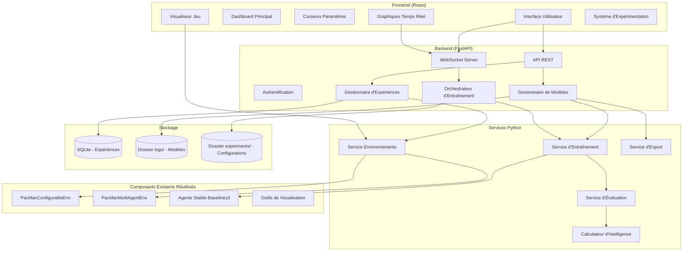

# Architecture du Laboratoire Scientifique IA Pac-Man

## Vision
Transformer le projet lab-ia-pacman existant en un "laboratoire scientifique" IA avec interface web unique, curseurs intuitifs, explications immédiates, système d'expérimentation organisé, graphiques temps réel, sauvegarde automatique intelligente, mesure d'intelligence et export ONNX.

## Architecture Générale

### Stack Technologique
- **Backend** : FastAPI (Python 3.14) pour API REST + WebSocket
- **Frontend** : React + TypeScript + Vite + Tailwind CSS
- **Visualisation** : Canvas HTML5 (remplacement Pygame) + WebGL pour performances
- **Communication** : WebSocket pour mises à jour temps réel
- **Base de données** : SQLite pour stockage des expériences
- **Orchestration** : Celery pour tâches d'entraînement asynchrones

### Diagramme d'Architecture



## Structure des Fichiers

```
lab-ia-pacman/
├── frontend/                    # Application React
│   ├── public/
│   ├── src/
│   │   ├── components/
│   │   │   ├── Dashboard/
│   │   │   ├── ParameterSliders/
│   │   │   ├── RealTimeCharts/
│   │   │   ├── GameVisualizer/
│   │   │   ├── ExperimentManager/
│   │   │   └── IntelligenceScore/
│   │   ├── hooks/
│   │   ├── services/
│   │   ├── types/
│   │   └── App.tsx
│   ├── package.json
│   └── vite.config.ts
├── backend/                     # API FastAPI
│   ├── app/
│   │   ├── api/
│   │   │   ├── v1/
│   │   │   │   ├── endpoints/
│   │   │   │   │   ├── experiments.py
│   │   │   │   │   ├── models.py
│   │   │   │   │   ├── training.py
│   │   │   │   │   └── visualization.py
│   │   │   │   └── websocket.py
│   │   ├── core/
│   │   │   ├── config.py
│   │   │   └── security.py
│   │   ├── services/
│   │   │   ├── environment_service.py
│   │   │   ├── training_service.py
│   │   │   ├── evaluation_service.py
│   │   │   ├── export_service.py
│   │   │   └── intelligence_scorer.py
│   │   ├── models/
│   │   │   ├── experiment.py
│   │   │   └── model.py
│   │   └── db/
│   │       └── database.py
│   ├── requirements.txt
│   └── main.py
├── src/                         # Code existant réutilisé
│   ├── pacman_env/
│   │   ├── configurable_env.py  # Environnement configurable
│   │   ├── multiagent_env.py    # Environnement multi-agent
│   │   └── multiagent_wrappers.py
│   ├── agents/
│   │   ├── random_agent.py
│   │   └── sb3_agent.py         # Wrapper Stable-Baselines3
│   └── utils/
│       └── helpers.py
├── experiments/                 # Configurations d'expériences
│   ├── templates/
│   └── saved/
├── logs/                        # Modèles sauvegardés
│   ├── pacman/
│   ├── ghosts/
│   └── experiments/
├── scripts/                     # Scripts utilitaires
├── tests/                       # Tests
├── docker-compose.yml
├── README.md
└── pyproject.toml
```

## Composants d'Interface

### 1. Dashboard Principal
- Vue d'ensemble des expériences en cours
- Statistiques globales
- Accès rapide aux fonctionnalités principales

### 2. Curseurs de Paramètres (20 paramètres)
Organisés par catégories :

**Catégorie Environnement**:
1. Taille de la grille (5-20)
2. Nombre de fantômes (1-4)
3. Nombre de points (0-100%)
4. Nombre de murs (0-50%)
5. Vies de Pac-Man (1-10)
6. Comportement des fantômes (random/chase/scatter)
7. Durée des power pellets (5-30 steps)

**Catégorie Algorithmes**:
8. Algorithme Pac-Man (DQN/PPO/A2C/SAC/TD3)
9. Algorithme Fantômes (DQN/PPO/A2C/SAC/TD3)
10. Learning rate (0.0001-0.01)
11. Gamma (0.9-0.999)
12. Batch size (32-1024)
13. Buffer size (1000-100000)

**Catégorie Récompenses**:
14. Récompense point (1-50)
15. Récompense fantôme vulnérable (10-100)
16. Pénalité mort (-200 - -10)
17. Récompense fantôme mange Pac-Man (10-200)

**Catégorie Visualisation**:
18. FPS (1-60)
19. Taille cellule (20-100 pixels)
20. Mode de rendu (simple/avancé)

**Fonctionnalités des curseurs**:
- Tooltip explicatif au survol
- Valeur numérique modifiable directement
- Présélections rapides (débutant/avancé/expert)
- Historique des modifications

### 3. Système d'Explications
- Panneau latéral avec documentation contextuelle
- Explications en langage naturel pour chaque paramètre
- Exemples d'effets des paramètres
- Recommandations basées sur la configuration

### 4. Graphiques Temps Réel (4 graphiques)
1. **Récompenses par épisode** : Courbe des récompenses cumulées
2. **Score d'intelligence** : Évolution du score 0-100
3. **Métriques d'apprentissage** : Loss, entropy, learning rate
4. **Statistiques de jeu** : Points collectés, vies restantes, fantômes mangés

### 5. Visualiseur de Jeu
- Canvas HTML5 avec rendu de la grille
- Contrôles de lecture (play/pause/step/rewind)
- Vitesse ajustable
- Overlay d'informations
- Mode comparaison côte à côte

### 6. Système d'Expérimentation
- Création d'expériences avec nom et description
- Organisation par projets et tags
- Comparaison automatique des résultats
- Export des configurations

### 7. Panneau d'Intelligence
- Score d'intelligence calculé (0-100)
- Détail des métriques composantes
- Comparaison avec les modèles de référence
- Recommandations d'amélioration

## Intégration des Composants Existants

### Environnements (70% réutilisable)
- `PacManConfigurableEnv` : déjà configurable, à adapter pour API
- `PacManMultiAgentEnv` : supporte power pellets, prêt pour multi-agent
- `SingleAgentWrapper` : permet d'isoler un agent dans un environnement multi-agent

### Agents
- `RandomAgent` : existant
- Wrappers Stable-Baselines3 : à créer pour intégration propre
- Support des modèles personnalisés via interface standardisée

### Visualisation
- Remplacer Pygame par Canvas HTML5
- Adapter `visual_pacman_advanced.py` pour générer des frames via API
- Créer un service de rendu côté backend

## API Spécifications

### Endpoints REST
- `GET /api/v1/experiments` : Liste des expériences
- `POST /api/v1/experiments` : Créer une expérience
- `GET /api/v1/experiments/{id}` : Détails d'une expérience
- `POST /api/v1/experiments/{id}/train` : Démarrer l'entraînement
- `GET /api/v1/models` : Liste des modèles sauvegardés
- `POST /api/v1/models/export` : Exporter un modèle en ONNX
- `GET /api/v1/environment/config` : Configuration actuelle
- `POST /api/v1/environment/config` : Mettre à jour la configuration
- `GET /api/v1/visualization/frame` : Obtenir une frame de visualisation

### WebSocket Events
- `training_progress` : Progression de l'entraînement
- `metrics_update` : Mise à jour des métriques
- `game_state` : État du jeu pour visualisation
- `experiment_status` : Statut de l'expérience

## Système de Sauvegarde Automatique

### Format ZIP + MD
```
experiment_20260103_153045.zip
├── model_pacman.zip            # Modèle Stable-Baselines3
├── model_ghosts.zip            # Modèles des fantômes
├── params.md                   # Documentation des paramètres
├── config.json                 # Configuration complète
├── metrics.csv                 # Métriques d'entraînement
├── intelligence_report.md      # Rapport d'intelligence
└── onnx/                       # Modèles exportés ONNX
    ├── pacman.onnx
    └── ghosts.onnx
```

### Contenu de `params.md`
```
# Configuration de l'expérience
- Date : 2026-01-03 15:30:45
- Score d'intelligence : 78/100

## Paramètres Environnement
- Taille grille : 12
- Nombre fantômes : 2
- ...

## Paramètres Algorithmes
- Algorithme Pac-Man : DQN
- Learning rate : 0.001
- ...

## Performances
- Reward moyen : 450.2
- Taux de victoire : 65%
- ...
```

## Mesure d'Intelligence (Score 0-100)

### Métriques composantes
1. **Efficacité de collecte** (30%) : Pourcentage de points collectés
2. **Survie** (25%) : Nombre moyen de steps avant mort
3. **Évitement des fantômes** (20%) : Distance moyenne aux fantômes
4. **Planification** (15%) : Variance des récompenses (stabilité)
5. **Adaptabilité** (10%) : Performance sur configurations variées

### Calcul
```
score = (efficacité × 0.3) + (survie × 0.25) + (évitement × 0.2) + 
        (planification × 0.15) + (adaptabilité × 0.1)
```

Chaque métrique normalisée sur une échelle 0-100 basée sur des benchmarks.

## Export ONNX Universel

### Processus
1. Conversion des modèles Stable-Baselines3 en PyTorch
2. Export ONNX avec métadonnées
3. Validation du modèle exporté
4. Packaging avec documentation

### Structure ONNX
- Input : Observation shape (size, size, canaux)
- Output : Logits des actions ou distribution
- Métadonnées : Hyperparamètres, date, score d'intelligence

## Plan de Migration Progressive

### Phase 1 : Fondations (Semaine 1)
1. Mettre en place l'architecture backend FastAPI
2. Créer les services d'environnement et d'entraînement
3. Adapter les environnements existants pour l'API
4. Implémenter l'API REST de base

### Phase 2 : Frontend (Semaine 2)
1. Initialiser l'application React avec Vite
2. Implémenter les composants de base (dashboard, curseurs)
3. Connecter le frontend à l'API
4. Implémenter les graphiques avec Chart.js

### Phase 3 : Visualisation (Semaine 3)
1. Créer le visualiseur Canvas HTML5
2. Adapter le rendu Pygame existant pour générer des frames
3. Implémenter les contrôles de lecture
4. Ajouter WebSocket pour les mises à jour temps réel

### Phase 4 : Fonctionnalités Avancées (Semaine 4)
1. Implémenter le système d'expérimentation
2. Développer le calculateur d'intelligence
3. Ajouter l'export ONNX
4. Implémenter la sauvegarde automatique

### Phase 5 : Polissage (Semaine 5)
1. Ajouter les explications et tooltips
2. Optimiser les performances
3. Écrire les tests
4. Documenter l'interface

## Dépendances et Bibliothèques

### Backend Python
- fastapi, uvicorn, websockets
- sqlalchemy, alembic (SQLite)
- celery (tâches asynchrones)
- stable-baselines3, torch, gymnasium
- numpy, pandas, matplotlib
- onnx, onnxruntime
- pillow (traitement d'images)

### Frontend
- react, react-dom
- typescript
- vite
- tailwindcss
- chart.js (graphiques)
- axios (requêtes HTTP)
- socket.io-client (WebSocket)
- react-hook-form (formulaires)
- framer-motion (animations)

### Développement
- pytest, pytest-asyncio
- black, isort, flake8
- mypy (type checking)
- docker, docker-compose

## Points d'Intégration avec le Code Existant

### 1. Environnements
- Adapter `PacManConfigurableEnv` pour accepter une configuration JSON
- Ajouter une méthode `to_dict()` pour sérialisation
- Créer un factory pour instancier les environnements depuis l'API

### 2. Agents
- Créer `SB3AgentWrapper` qui encapsule DQN/PPO/etc.
- Standardiser l'interface `act(observation)` et `learn(experiences)`
- Ajouter support de chargement/sauvegarde via API

### 3. Visualisation
- Extraire la logique de rendu de `visual_pacman_advanced.py`
- Créer `Renderer` qui génère des images PNG/JPEG
- Exposer via endpoint `/api/v1/visualization/frame`

### 4. Entraînement
- Réutiliser `TrainingCallback` existant
- Adapter pour envoyer des métriques via WebSocket
- Intégrer avec Celery pour l'exécution asynchrone

## Métriques de Succès

1. **Performance** : Interface réactive (< 100ms de latence)
2. **Utilisabilité** : Courbe d'apprentissage < 5 minutes
3. **Fiabilité** : 99% de disponibilité des fonctionnalités
4. **Extensibilité** : Support d'au moins 5 algorithmes RL
5. **Interopérabilité** : Export ONNX fonctionnel avec 3 frameworks

## Risques et Atténuation

### Risque 1 : Complexité de l'intégration WebSocket
- Atténuation : Commencer avec polling HTTP, migrer progressivement vers WebSocket

### Risque 2 : Performances de visualisation
- Atténuation : Utiliser WebGL pour le rendu, optimiser le transfert de données

### Risque 3 : Compatibilité ONNX
- Atténuation : Tester avec plusieurs versions