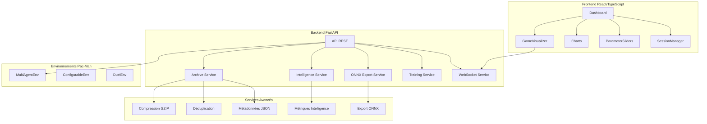

# Guide de démarrage - Laboratoire Scientifique IA Pac-Man

## Vue d'ensemble

Ce guide explique comment lancer et utiliser l'application complète du laboratoire scientifique IA Pac-Man. L'application comprend :

1. **Backend FastAPI** : API REST + WebSocket sur `http://localhost:8000`
2. **Frontend React/TypeScript** : Interface web moderne sur `http://localhost:3000`
3. **Services avancés** : Archivage, intelligence, export ONNX, visualisation

## Prérequis

- Python 3.11.9 (environnement virtuel `venv311`)
- Node.js 18+ (pour le frontend)
- Git (optionnel)

## Installation rapide

### 1. Activer l'environnement Python

```bash
# Depuis la racine du projet
cd g:/Drive/bogny/projet-ia-code/lab-ia-pacman

# Activer l'environnement virtuel
venv311\Scripts\activate
```

### 2. Installer les dépendances backend

```bash
cd backend
pip install -r requirements_minimal.txt
```

### 3. Installer les dépendances frontend

```bash
cd frontend
npm install
```

## Lancement manuel

### Option A : Lancement séparé (recommandé)

**Terminal 1 - Backend :**

```bash
cd backend
python -m app_simple
```

**Terminal 2 - Frontend :**

```bash
cd frontend
npm run dev
```

### Option B : Script de démarrage automatique

Un script `start.bat` est disponible (à créer en mode Code) :

```bash
start.bat
```

## Vérification du fonctionnement

1. **Backend** : Ouvrir `http://localhost:8000/docs` pour voir l'API Swagger
2. **Frontend** : Ouvrir `http://localhost:3000` pour voir l'interface
3. **Connexion** : Vérifier que le frontend peut récupérer les données du backend

## Architecture détaillée



## Fonctionnalités principales

### 1. Visualisation du jeu

- Canvas HTML5 avec animation fluide
- Contrôles de vitesse, pause, rejouer
- Affichage des scores en temps réel

### 2. Système d'archivage

- Compression GZIP automatique
- Déduplication des états similaires
- Métadonnées enrichies (algorithmes, paramètres)
- Recherche et reprise de sessions

### 3. Mesure d'intelligence

- Score composite (0-100) basé sur 7 métriques
- Comparaison avec des baselines
- Recommandations d'amélioration
- Visualisation des tendances

### 4. Export ONNX

- Conversion des modèles RL en format standard
- Interopérabilité avec PyTorch, TensorFlow
- Validation de compatibilité

### 5. Interface utilisateur

- Curseurs de paramètres avec tooltips
- Graphiques interactifs (Chart.js)
- Gestion des sessions (créer, charger, supprimer)
- Mode sombre/clair

## Dépannage

### Problème : Backend ne démarre pas

```bash
# Vérifier les imports
python test_imports_venv311.py

# Vérifier les dépendances
pip list | findstr fastapi
```

### Problème : Frontend ne se connecte pas

```bash
# Vérifier que le backend répond
curl http://localhost:8000/health

# Vérifier les logs du backend
# Vérifier les erreurs dans la console du navigateur (F12)
```

### Problème : Encodage Windows

```bash
# Exécuter le script de configuration d'encodage
scripts\set_encoding.bat
```

## Prochaines étapes

Une fois l'application lancée :

1. **Explorer l'interface** : Tester les différents composants
2. **Lancer une session** : Créer une nouvelle expérience
3. **Archiver des résultats** : Utiliser le système d'archivage
4. **Exporter un modèle** : Tester l'export ONNX
5. **Analyser l'intelligence** : Consulter les métriques

## Support

- Documentation : `docs/` directory
- Plans d'architecture : `plans/` directory
- Tests d'intégration : `backend/test_integration.py`
- Issues : Créer un ticket GitHub

---

**Note** : Cette application est un **laboratoire scientifique complet**, pas une simple copie des anciens fichiers `main.py`. Elle intègre des fonctionnalités avancées d'archivage, d'intelligence mesurable et d'interopérabilité qui n'existaient pas auparavant.
