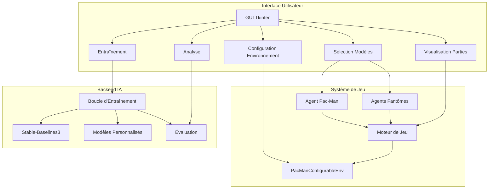

# Plan d'amélioration du laboratoire IA Pacman

## Objectifs
Transformer le projet actuel en un laboratoire complet permettant :
1. **Évolution de l'intelligence** : Comparaison des modèles (Pac-Man vs fantôme) avec visualisation des résumés de parties.
2. **Régler les paramètres** de chaque modèle (hyperparamètres d'apprentissage).
3. **Ajouter des contraintes au jeu** : murs, nombre de boules, nombre de fantômes, vies, règles modifiables.
4. **Clarifier si les modèles sont préexistants ou personnels**.
5. **Confrontation de modèles personnels vs autres modèles**, avec choix des modèles pour chaque rôle.
6. **Explications des paramètres et modèles** dans l'interface.
7. **Visualisation temps réel** (avec pas toutes les frames).

## Architecture proposée

### 1. Environnement configurable (`PacManConfigurableEnv`)
Remplacer `PacManDuelEnv` par une classe plus flexible avec paramètres :
- `grid_size` : taille de la grille (par défaut 10)
- `walls` : liste de positions de murs (bloquants)
- `num_ghosts` : nombre de fantômes (1-4)
- `num_dots` : nombre de points (peut être placés aléatoirement ou selon un pattern)
- `lives` : vies de Pac-Man (par défaut 3)
- `ghost_behavior` : comportement des fantômes (aléatoire, poursuite, fuite)
- `reward_structure` : récompenses personnalisables (manger point, manger fantôme, mort, etc.)

L'environnement doit être multi-agent : chaque fantôme peut avoir son propre modèle ou un comportement scripté.

### 2. Système de modèles
Introduire une abstraction `Agent` avec les implémentations :
- `RandomAgent` (existant)
- `ScriptedAgent` (fantômes avec comportement prédéfini)
- `StableBaselinesAgent` (wrapper pour DQN, PPO, A2C, etc.)
- `CustomModelAgent` (pour intégrer des modèles personnels en PyTorch/TensorFlow)
- `HumanAgent` (contrôle clavier/souris)

Chaque agent peut être assigné à un rôle : Pac-Man ou fantôme spécifique.

### 3. Interface graphique avancée
Refondre `main.py` en une interface modulaire avec onglets :

#### Onglet 1 : Configuration de l'environnement
- Sliders/inputs pour chaque paramètre (taille grille, nombre de fantômes, etc.)
- Éditeur visuel de murs (cliquer sur une grille pour placer/enlever des murs)
- Prévisualisation de la configuration.

#### Onglet 2 : Sélection des modèles
- Pour Pac-Man : dropdown avec liste des agents disponibles (Random, DQN, PPO, Custom...)
- Pour chaque fantôme : choix individuel.
- Boutons "Charger un modèle" pour les agents personnalisés.
- Explications courtes pour chaque type de modèle (tooltips).

#### Onglet 3 : Entraînement
- Hyperparamètres d'apprentissage (learning rate, gamma, batch size, etc.) par modèle.
- Possibilité d'entraîner Pac-Man uniquement, les fantômes uniquement, ou les deux.
- Graphiques en temps réel : récompenses, longueurs d'épisode, taux de victoire.
- Boutons pause/reprendre/sauvegarder.

#### Onglet 4 : Visualisation & Confrontation
- Fenêtre de visualisation du jeu (utilisant Pygame intégré dans Tkinter ou fenêtre séparée).
- Contrôle de la vitesse (frames par seconde) et possibilité de sauter des frames.
- Résumé de la partie en cours (score, vies restantes, steps).
- Historique des parties avec statistiques comparatives.
- Bouton "Lancer une série de confrontations" pour évaluer les modèles sur N épisodes.

#### Onglet 5 : Analyse & Explications
- Documentation des paramètres (glossaire).
- Explication des algorithmes disponibles.
- Graphiques comparatifs des performances des modèles sur plusieurs métriques.

### 4. Pipeline d'entraînement et d'évaluation
- **Entraînement** : utiliser Stable-Baselines3 avec environnement vectorisé (un environnement par fantôme si besoin).
- **Évaluation** : exécuter des épisodes de test sans apprentissage, collecter des métriques (score moyen, taux de victoire, distance moyenne aux fantômes).
- **Enregistrement des parties** : sauvegarder des replays (séquences d'actions/états) pour relecture.

### 5. Intégration de modèles personnalisés
- Définir une interface simple (`CustomAgent`) avec méthode `act(observation)` et `learn(experiences)`.
- Fournir un exemple de modèle personnalisé dans `src/agents/custom_agent.py`.
- Permettre de charger des poids depuis des fichiers `.pth` ou `.h5`.

## Étapes de mise en œuvre

### Phase 1 : Environnement configurable
1. Créer `PacManConfigurableEnv` dans `src/pacman_env/configurable_env.py`.
2. Implémenter les paramètres de base (murs, nombre de fantômes, points).
3. Mettre à jour les tests unitaires.

### Phase 2 : Système d'agents modulaire
1. Refactoriser `src/agents/` avec une classe de base `BaseAgent`.
2. Implémenter `ScriptedAgent` (fantôme qui suit Pac-Man).
3. Créer `StableBaselinesAgent` générique.
4. Ajouter `CustomAgent` squelette.

### Phase 3 : Interface graphique avancée
1. Restructurer `main.py` en utilisant des notebooks ttk (onglets).
2. Implémenter l'onglet configuration avec éditeur de murs.
3. Implémenter l'onglet sélection des modèles.
4. Intégrer la visualisation Pygame dans un canvas Tkinter.

### Phase 4 : Pipeline d'entraînement/évaluation
1. Adapter la boucle d'entraînement pour gérer plusieurs agents.
2. Ajouter des callbacks pour l'enregistrement des métriques.
3. Créer un module de visualisation des résultats (`src/utils/visualization.py`).

### Phase 5 : Documentation et explications
1. Ajouter des tooltips et une aide contextuelle dans l'interface.
2. Créer un fichier `docs/parameters.md` expliquant chaque paramètre.
3. Rédiger un tutoriel dans `notebooks/advanced_usage.ipynb`.

## Diagramme d'architecture

## Fichiers à créer/modifier

### Nouveaux fichiers
- `src/pacman_env/configurable_env.py`
- `src/agents/base_agent.py`
- `src/agents/scripted_agent.py`
- `src/agents/stable_baselines_agent.py`
- `src/agents/custom_agent.py`
- `src/gui/` (répertoire)
  - `config_panel.py`
  - `model_panel.py`
  - `training_panel.py`
  - `visualization_panel.py`
  - `analysis_panel.py`
- `src/utils/metrics.py`
- `src/utils/replay.py`
- `plans/laboratoire_pacman_avance.md` (ce fichier)

### Fichiers à modifier
- `main.py` → devenir un lanceur qui charge les panels.
- `src/pacman_env/duel_env.py` → déprécié ou étendu.
- `requirements.txt` → ajouter éventuellement `pygame-ce` (déjà présent) et `tensorboard` (déjà présent).

## Priorités et estimation d'effort

**Priorité haute** (fonctionnalités de base) :
1. Environnement configurable (murs, fantômes multiples) – 2-3 jours.
2. Interface de configuration et visualisation – 3-4 jours.
3. Sélection des modèles et chargement – 1-2 jours.

**Priorité moyenne** (améliorations) :
4. Pipeline d'entraînement multi-agent – 2-3 jours.
5. Explications et documentation intégrée – 1-2 jours.

**Priorité basse** (optimisations) :
6. Enregistrement/relecture des parties – 1 jour.
7. Tests unitaires étendus – 1 jour.

## Prochaines actions
1. Obtenir l'accord de l'utilisateur sur ce plan.
2. Commencer la Phase 1 (Environnement configurable) en mode Code.
3. Itérer avec des démonstrations après chaque phase.

---
*Document créé le 2026-01-02 par Kilo Code (mode Architect).*