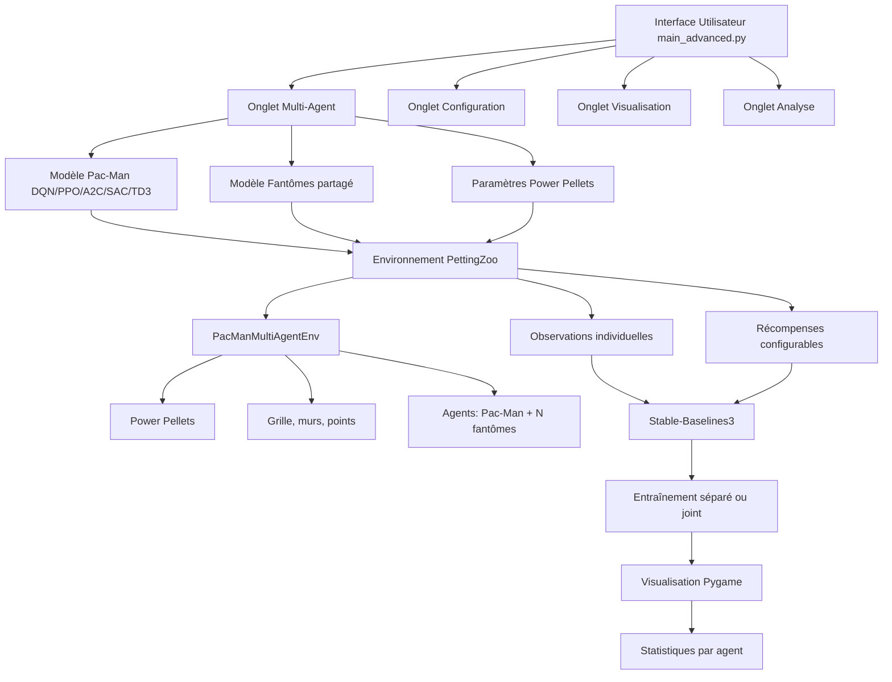

# Plan d'implémentation : Laboratoire Pac‑Man Multi‑Agent avec Power Pellets

## Objectifs
1. Étendre l'environnement Pac‑Man pour supporter l'apprentissage multi‑agent avec des objectifs distincts.
2. Ajouter des power pellets avec durée d'effet configurable.
3. Proposer une interface graphique avancée pour configurer et visualiser les agents.
4. Intégrer des algorithmes RL supplémentaires (A2C, SAC, TD3) avec Stable‑Baselines3.

## Architecture globale



## Étapes d'implémentation prioritaires

### Phase 1 : Préparation des dépendances
1. **Mettre à jour `requirements.txt`** :
   - Ajouter `pettingzoo>=1.24.0`
   - Vérifier les versions de `stable-baselines3` (inclut A2C, SAC, TD3)
2. **Créer un environnement de test** avec `pip install -r requirements.txt`

### Phase 2 : Environnement multi‑agent (PettingZoo)
3. **Créer `src/pacman_env/multiagent_env.py`** :
   - Hériter de `pettingzoo.AECEnv`
   - Reprendre la logique de `PacManConfigurableEnv`
   - Ajouter la gestion de plusieurs agents (Pac‑Man + N fantômes)
   - Implémenter les power pellets :
     - Positions aléatoires (2 par défaut)
     - Durée d'effet configurable (10 steps)
     - État vulnérable des fantômes (couleur bleue)
   - Définir les espaces d'observation et d'action par agent
   - Implémenter les récompenses configurables par agent
4. **Adapter `src/pacman_env/__init__.py`** pour exposer le nouvel environnement.

### Phase 3 : Intégration avec Stable‑Baselines3
5. **Créer un wrapper `MultiAgentWrapper`** pour convertir l'environnement PettingZoo en format compatible avec SB3 (si nécessaire).
6. **Écrire des scripts d'entraînement** :
   - `train_pacman.py` : entraîne le modèle de Pac‑Man
   - `train_ghosts.py` : entraîne le modèle partagé des fantômes
7. **Ajouter les imports des nouveaux algorithmes** (A2C, SAC, TD3) dans `main_advanced.py`.

### Phase 4 : Extension de l'interface graphique
8. **Modifier `main_advanced.py`** :
   - Ajouter un onglet "Multi‑Agent" avec :
     - Sélection du modèle pour Pac‑Man (liste : DQN, PPO, A2C, SAC, TD3)
     - Sélection du modèle pour les fantômes (même liste)
     - Configuration du nombre de power pellets (0‑4) et durée (5‑20 steps)
     - Boutons "Entraîner Pac‑Man", "Entraîner Fantômes", "Entraîner Joint"
   - Mettre à jour l'onglet Visualisation pour afficher les power pellets (couleur bleue)
   - Étendre l'onglet Analyse avec des graphiques par agent
9. **Mettre à jour `visual_pacman.py`** (ou créer `visual_pacman_multi.py`) :
   - Afficher les power pellets
   - Gérer plusieurs fantômes avec des couleurs distinctes
   - Afficher l'état vulnérable (fantômes bleus)

### Phase 5 : Tests et validation
10. **Écrire des tests unitaires** pour le nouvel environnement (`tests/test_multiagent_env.py`).
11. **Tester l'entraînement** avec chaque algorithme (DQN, PPO, A2C, SAC, TD3) sur un scénario simple.
12. **Valider l'interface graphique** : vérifier que les paramètres sont bien appliqués.

### Phase 6 : Documentation et exemples
13. **Mettre à jour `README.md`** avec les nouvelles fonctionnalités.
14. **Créer un notebook Jupyter** `notebooks/multiagent_pacman.ipynb` démontrant l'utilisation.
15. **Ajouter des commentaires** dans le code et docstrings.

## Décisions techniques

### Récompenses configurables
Structure proposée :
```python
reward_config = {
    "pacman": {
        "dot": 10.0,
        "ghost_eaten": 50.0,
        "death": -100.0,
        "step": -0.1,
        "power_pellet_eaten": 20.0
    },
    "ghost": {
        "eat_pacman": 100.0,
        "eaten_by_pacman": -50.0,
        "step": -0.1,
        "distance_to_pacman": 0.0  # récompense pour fuite/approche
    }
}
```

### Partage de poids des fantômes
- Un seul modèle entraîné avec les observations de chaque fantôme.
- Chaque fantôme a sa propre instance d'agent mais partage les paramètres du modèle.
- Alternative : un modèle par fantôme (plus complexe mais plus flexible).

### Gestion des power pellets
- Lorsque Pac‑Man mange un power pellet :
  - Tous les fantômes deviennent vulnérables pendant `power_duration` steps.
  - Leur couleur change (bleu).
  - Leur objectif passe de "manger Pac‑Man" à "fuir Pac‑Man".
  - Si Pac‑Man mange un fantôme vulnérable, récompense positive pour Pac‑Man, négative pour le fantôme.
- Après la durée, les fantômes redeviennent normaux.

## Risques et mitigations
- **Complexité de PettingZoo** : Courbe d'apprentissage. Atténuation : suivre les tutoriels officiels.
- **Performance** : Multi‑agent peut ralentir l'entraînement. Atténuation : utiliser des grilles petites pour les tests.
- **Compatibilité SB3** : SB3 n'est pas conçu pour le multi‑agent. Atténuation : utiliser des wrappers ou entraîner les agents séparément.

## Livrables
1. Environnement `PacManMultiAgentEnv` fonctionnel.
2. Interface graphique étendue avec onglet Multi‑Agent.
3. Scripts d'entraînement pour tous les algorithmes SB3.
4. Documentation mise à jour.
5. Tests unitaires.

## Prochaines étapes après validation
- Implémenter l'apprentissage collaboratif/compétitif.
- Ajouter des mécaniques avancées (portails, fruits bonus).
- Intégrer des algorithmes multi‑agent spécialisés (MADDPG, QMIX).