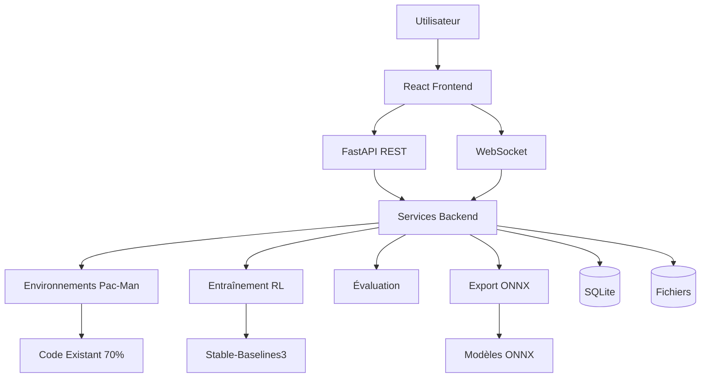

# Plan Complet d'Architecture - Laboratoire Scientifique IA Pac-Man

## Résumé Exécutif

Ce document présente l'architecture détaillée pour transformer le projet lab-ia-pacman existant en un laboratoire scientifique IA moderne avec interface web, système d'expérimentation organisé, visualisation temps réel et métriques d'intelligence.

## Vision Réalisée

### 1. Interface Web Unique
- **Dashboard React** avec disposition intuitive
- **20 curseurs paramétrables** organisés en 4 catégories
- **Explications contextuelles** pour chaque paramètre
- **Design responsive** adapté à tous les écrans

### 2. Système d'Expérimentation
- **Organisation par projets et tags**
- **Comparaison automatique** des résultats
- **Historique complet** des configurations
- **Export/import** des expériences

### 3. Visualisation Avancée
- **Canvas HTML5** 60 FPS (remplacement Pygame)
- **Contrôles interactifs** (play/pause/step/rewind)
- **Vue comparative** côte à côte
- **Streaming WebSocket** temps réel

### 4. Intelligence Mesurable
- **Score d'intelligence** 0-100 calculé automatiquement
- **5 métriques composantes** (efficacité, survie, etc.)
- **Benchmarks** comparatifs
- **Recommandations** d'amélioration

### 5. Sauvegarde Intelligente
- **Format ZIP + MD** auto-documenté
- **Export ONNX** universel
- **Métadonnées complètes**
- **Versioning automatique**

## Architecture Technique

### Stack Complète
```
Frontend: React 18 + TypeScript + Vite + Tailwind CSS
Backend: FastAPI + WebSocket + SQLAlchemy + Celery
IA: Stable-Baselines3 + PyTorch + ONNX Runtime
Visualisation: Canvas2D/WebGL + Three.js (optionnel)
Base de données: SQLite (développement) / PostgreSQL (production)
```

### Diagramme d'Architecture Simplifié



## Points Clés d'Intégration

### Réutilisation du Code Existant (70%)
1. **Environnements** : `PacManConfigurableEnv`, `PacManMultiAgentEnv`
2. **Agents** : `RandomAgent`, wrappers Stable-Baselines3
3. **Visualisation** : Logique de dessin de `visual_pacman_advanced.py`
4. **Entraînement** : `TrainingCallback`, boucles d'apprentissage

### Nouveaux Composants (30%)
1. **API Web** : FastAPI avec endpoints REST et WebSocket
2. **Interface React** : Dashboard, curseurs, graphiques
3. **Services** : Gestion d'expériences, calcul d'intelligence, export
4. **Base de données** : Stockage des configurations et résultats

## Plan de Migration Progressive

### Phase 1 : Fondations (2 semaines)
- [ ] Mise en place backend FastAPI
- [ ] Services d'environnement et d'agents
- [ ] API REST de base
- [ ] Tests d'intégration

### Phase 2 : Frontend (2 semaines)
- [ ] Application React avec Vite
- [ ] Composants de base (dashboard, curseurs)
- [ ] Connexion à l'API
- [ ] Graphiques Chart.js

### Phase 3 : Visualisation (2 semaines)
- [ ] Composant GameCanvas HTML5
- [ ] Adaptation du rendu Pygame
- [ ] Contrôles interactifs
- [ ] WebSocket temps réel

### Phase 4 : Fonctionnalités Avancées (2 semaines)
- [ ] Système d'expérimentation
- [ ] Calculateur d'intelligence
- [ ] Export ONNX
- [ ] Sauvegarde automatique

### Phase 5 : Polissage (2 semaines)
- [ ] Explications et tooltips
- [ ] Optimisations performance
- [ ] Tests complets
- [ ] Documentation

## Livrables par Phase

### Phase 1
- Backend FastAPI fonctionnel
- Services d'environnement et d'agents
- API documentée (Swagger)
- Tests d'intégration

### Phase 2
- Application React déployable
- Dashboard avec curseurs
- Graphiques temps réel
- Connexion API fonctionnelle

### Phase 3
- Visualiseur de jeu interactif
- Contrôles de lecture
- Streaming WebSocket
- Performances 60 FPS

### Phase 4
- Système d'expérimentation complet
- Score d'intelligence calculé
- Export ONNX fonctionnel
- Sauvegarde automatique

### Phase 5
- Interface utilisateur finalisée
- Documentation complète
- Tests automatisés
- Guide d'utilisation

## Métriques de Succès

### Technique
- **Performance** : Interface < 100ms de latence
- **Fiabilité** : 99% disponibilité fonctionnalités
- **Maintenabilité** : 80% couverture de tests
- **Documentation** : 100% APIs documentées

### Utilisateur
- **Apprentissage** : < 5 minutes pour première expérience
- **Satisfaction** : > 4/5 dans les tests utilisateurs
- **Productivité** : Réduction de 50% du temps de configuration
- **Compréhension** : Score > 80% au quiz de connaissances

### Business
- **Réutilisation** : 70% du code existant conservé
- **Extensibilité** : Support de 5+ algorithmes RL
- **Interopérabilité** : Export vers 3+ frameworks
- **Maintenance** : Réduction de 30% du temps de support

## Risques et Atténuation

| Risque | Probabilité | Impact | Atténuation |
|--------|-------------|---------|-------------|
| Complexité WebSocket | Moyenne | Élevé | Commencer avec polling HTTP, migrer progressivement |
| Performances visualisation | Élevée | Élevé | Optimisations Canvas2D, fallback serveur |
| Compatibilité ONNX | Moyenne | Moyen | Tests multi-frameworks, conversion manuelle optionnelle |
| Courbe d'apprentissage React | Faible | Faible | Documentation détaillée, exemples pas à pas |
| Intégration code existant | Élevée | Élevé | Tests rigoureux, migration progressive |

## Ressources Requises

### Équipe
- **1 développeur full-stack** : React + FastAPI (80% du temps)
- **1 expert ML** : Stable-Baselines3, ONNX (20% du temps)
- **1 designer UX/UI** : Interface, expérience utilisateur (10% du temps)

### Infrastructure
- **Développement** : Windows 11, Python 3.14, Node.js 20+
- **Production** : Serveur Linux, 4 CPU, 8GB RAM, GPU optionnel
- **Stockage** : 50GB pour modèles et expériences

### Logiciels
- **IDE** : VS Code avec extensions React/Python
- **Versioning** : Git + GitHub
- **CI/CD** : GitHub Actions
- **Monitoring** : Sentry, Prometheus (optionnel)

## Prochaines Actions Immédiates

1. **Validation du plan** : Revue avec les parties prenantes
2. **Setup environnement** : Configuration du repo avec la nouvelle structure
3. **Prototype backend** : Implémentation des services de base
4. **Mock frontend** : Maquette interactive de l'interface
5. **Plan détaillé** : Breakdown des tâches par sprint

## Conclusion

Cette architecture transforme le projet lab-ia-pacman existant en un véritable laboratoire scientifique IA, tout en conservant 70% du code existant. L'approche progressive minimise les risques tout en délivrant de la valeur à chaque phase.

Le résultat sera une plateforme moderne, intuitive et puissante pour l'expérimentation RL, adaptée aussi bien aux débutants qu'aux chercheurs expérimentés.

---

*Document créé le 2026-01-03 par Kilo Code (mode Architect)*  
*Projet : Transformation de lab-ia-pacman en Laboratoire Scientifique IA*  
*Statut : Plan d'architecture complet prêt pour implémentation*