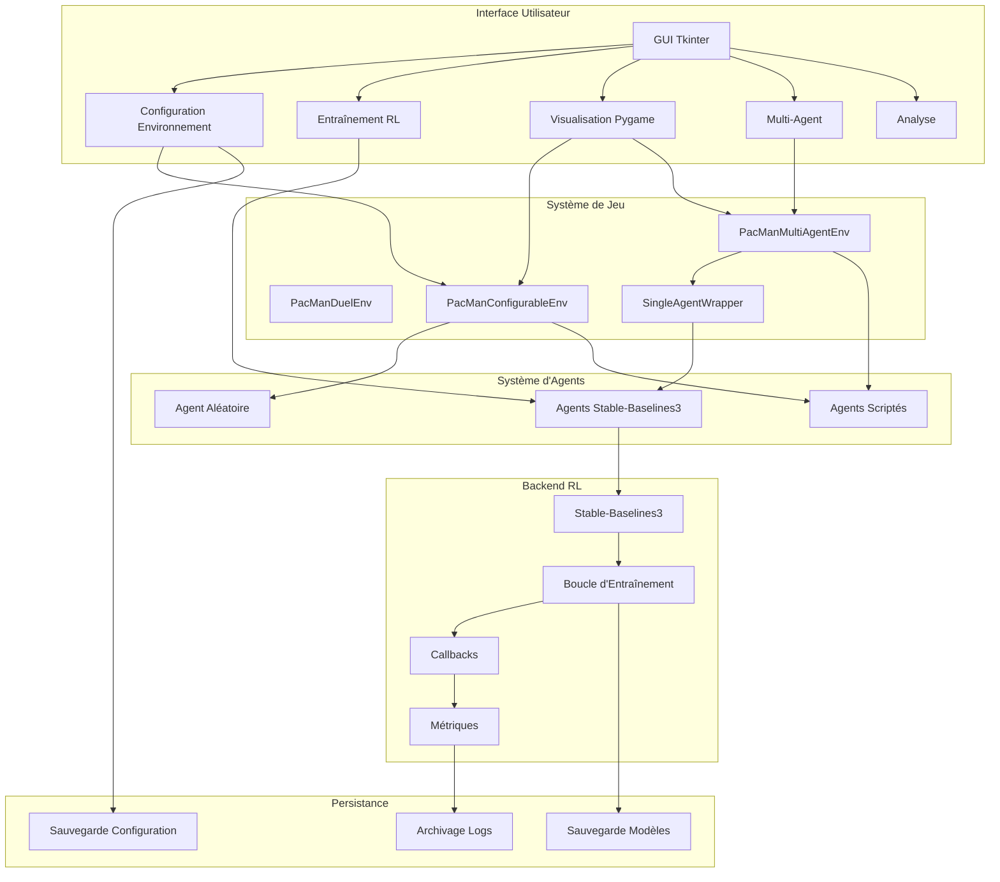

# Description du projet Lab IA Pacman

## But et Utilité

Le **Lab IA Pacman** est un laboratoire d'intelligence artificielle conçu pour l'expérimentation d'algorithmes d'apprentissage par renforcement (RL) dans un environnement simplifié de Pac-Man. Son objectif principal est de fournir une plateforme pédagogique et expérimentale permettant :

1. **L'étude comparative** des algorithmes RL (DQN, PPO, A2C, SAC, TD3) sur un problème de jeu classique
2. **L'expérimentation multi-agent** avec des interactions complexes entre Pac-Man et les fantômes
3. **La configuration flexible** de l'environnement (murs, nombre de fantômes, points, vies, comportements)
4. **La visualisation en temps réel** des apprentissages et des performances
5. **L'intégration de modèles personnalisés** pour la recherche avancée

## Fonctionnement

Le projet fonctionne selon une architecture modulaire :

### 1. **Environnements de jeu**
- **`PacManDuelEnv`** : Environnement simplifié 10x10 avec Pac-Man vs 1 fantôme
- **`PacManConfigurableEnv`** : Environnement mono-agent hautement configurable (taille, murs, fantômes multiples, vies)
- **`PacManMultiAgentEnv`** : Environnement multi-agent basé sur PettingZoo avec power pellets et récompenses distinctes par agent

### 2. **Système d'agents**
- **Agent aléatoire** (`RandomAgent`) : Baseline pour les tests
- **Agents RL** via Stable-Baselines3 : DQN, PPO, A2C, SAC, TD3
- **Agents scriptés** : Fantômes avec comportements prédéfinis (random, chase, scatter)
- **Wrapper multi-agent** (`SingleAgentWrapper`) : Permet d'entraîner un agent dans un environnement multi-agent

### 3. **Interface utilisateur**
- **Interface principale** (`main.py`) : GUI Tkinter avec entraînement, tests, sauvegarde/chargement
- **Interface avancée** (`main_advanced.py`) : Interface à onglets avec configuration, visualisation, multi-agent, analyse
- **Visualisations Pygame** : Fenêtres graphiques pour observer les parties en temps réel

### 4. **Pipeline d'entraînement**
1. Configuration de l'environnement via l'interface
2. Sélection de l'algorithme et des hyperparamètres
3. Entraînement dans un thread séparé (pour ne pas bloquer l'interface)
4. Collecte des métriques (récompenses, longueurs d'épisode)
5. Sauvegarde des modèles dans `logs/`
6. Évaluation et visualisation des performances

## Fonctionnalités principales

### Configuration avancée
- **Grille configurable** : Taille de 5x5 à 20x20
- **Murs personnalisables** : Éditeur graphique ou placement aléatoire
- **Fantômes multiples** : 1 à 4 fantômes avec comportements distincts
- **Points configurables** : Nombre fixe ou remplissage automatique
- **Vies de Pac-Man** : 1 à 10 vies par épisode
- **Power pellets** : Boules spéciales rendant les fantômes vulnérables (5-30 steps)

### Apprentissage multi-agent
- **Récompenses distinctes** : Configuration séparée pour Pac-Man et les fantômes
- **Partage de poids** : Option pour partager les poids entre fantômes
- **Entraînement séparé** : Possibilité d'entraîner Pac-Man seul, les fantômes seuls, ou les deux
- **Algorithmes par agent** : Choix indépendant d'algorithme pour chaque type d'agent

### Visualisation et analyse
- **Graphiques temps réel** : Récompenses et longueurs d'épisode
- **Visualisation Pygame** : Fenêtre graphique avec contrôle FPS
- **Statistiques détaillées** : Métriques par agent, taux de victoire, distance moyenne
- **Explications intégrées** : Documentation des paramètres et algorithmes

### Gestion des modèles
- **Sauvegarde/chargement** : Modèles au format ZIP
- **Archivage des logs** : Compression automatique des logs de simulation
- **Modèles temporaires** : Pour la visualisation avec modèles entraînés

## Technologies utilisées

### Langages et frameworks
- **Python 3.9-3.14** : Langage principal
- **Gymnasium** : API standard pour les environnements RL
- **Stable-Baselines3** : Implémentation des algorithmes RL
- **PettingZoo** : API pour les environnements multi-agent
- **PyTorch** : Backend pour les réseaux de neurones

### Interfaces graphiques
- **Tkinter** : Interface principale (inclus dans Python)
- **Pygame-ce** : Visualisation graphique des parties
- **Matplotlib** : Graphiques de performance

### Outils de développement
- **pytest** : Tests unitaires
- **Jupyter Notebooks** : Documentation et exemples
- **Git** : Gestion de version

## Architecture technique



## Structure des fichiers

```
lab-ia-pacman/
├── main.py                    # Interface graphique principale
├── main_advanced.py           # Interface avancée à onglets
├── visual_pacman.py           # Visualisation Pygame (duel)
├── visual_pacman_advanced.py  # Visualisation configurable
├── visual_pacman_multiagent.py # Visualisation multi-agent
├── train_pacman_multiagent.py # Script d'entraînement multi-agent
├── src/
│   ├── main_gui.py           # GUI (identique à main.py)
│   ├── run_pacman.py         # Runner minimal avec agent aléatoire
│   ├── pacman_env/
│   │   ├── duel_env.py       # Environnement duel
│   │   ├── configurable_env.py # Environnement configurable
│   │   ├── multiagent_env.py   # Environnement multi-agent
│   │   ├── multiagent_wrappers.py # Wrappers pour entraînement single-agent
│   │   └── __init__.py       # Export des environnements
│   ├── agents/
│   │   └── random_agent.py   # Agent aléatoire
│   └── utils/
│       └── helpers.py        # Fonctions utilitaires
├── tests/                    # Tests unitaires
├── notebooks/               # Notebooks pédagogiques
├── logs/                    # Modèles sauvegardés et logs
├── plans/                   # Plans de développement
└── requirements.txt         # Dépendances Python
```

## Cas d'utilisation

### 1. **Étudiant en IA**
- Explorer les algorithmes RL de base (DQN vs PPO)
- Observer l'impact des hyperparamètres (learning rate, gamma)
- Comprendre les challenges du multi-agent

### 2. **Chercheur**
- Tester de nouveaux algorithmes RL
- Expérimenter avec des configurations d'environnement complexes
- Analyser les interactions multi-agent

### 3. **Enseignant**
- Démonstrations en classe des concepts RL
- Exercices pratiques pour les étudiants
- Comparaison visuelle des performances

### 4. **Développeur**
- Extension avec de nouveaux environnements
- Intégration de modèles personnalisés
- Amélioration de l'interface utilisateur

## Points forts

1. **Modularité** : Architecture clairement séparée (environnements, agents, interface)
2. **Configurabilité** : Presque tous les aspects du jeu sont paramétrables
3. **Multi-agent natif** : Support complet des interactions multi-agent
4. **Visualisation riche** : Interface graphique complète avec visualisation temps réel
5. **Intégration professionnelle** : Utilisation des standards de l'industrie (Gymnasium, Stable-Baselines3)
6. **Documentation intégrée** : Explications des paramètres et algorithmes dans l'interface

## Limitations connues

1. **Performance** : L'entraînement peut être lent sur CPU uniquement
2. **Complexité limitée** : Environnement simplifié par rapport au jeu original
3. **Interface** : Peut geler pendant les entraînements longs (malgré les threads)

Le projet représente une plateforme complète pour l'expérimentation RL, alliant simplicité d'utilisation et capacités avancées pour la recherche.